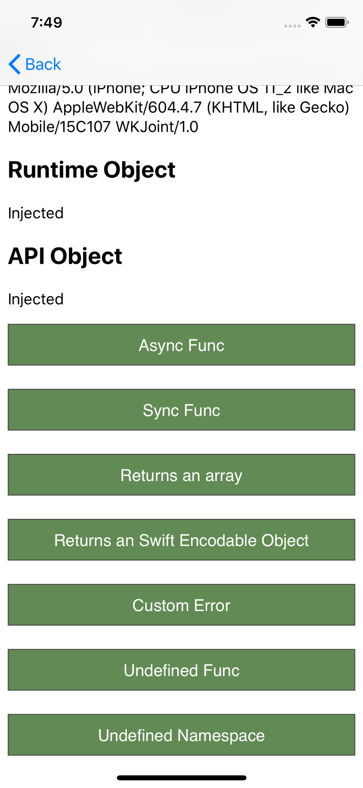

# WKJoint

JavaScript to Native(Swift) Bridge

## Features

* Promise based API in JavaScript side.
* Runtime automatically injected to WebView, no need to import extra script files.
* Support for native implementations in both async and sync ways.
* Support for Swift 4's Codable API.
* Custom user agent support.
* WKJoint supports iOS 8, but the demo project won't work on iOS 8 because of the buggy `loadHTMLString` method of WKWebView in iOS 8 ([See details](https://stackoverflow.com/questions/24882834/wkwebview-not-loading-local-files-under-ios-8)).

## Demo & Examples



JavaScript side:

```javascript
const api = window.MyJavaScriptAPI;
if (api) {
  // call a math.add function implemented in native side
  api.math.add({ x: -3, y: 120 })
    .then((res) => {
      console.log(`Succeeded: ${res}`);
    })
    .catch((err) => {
      console.log(`Error occurred: ${err}`);
    });

  // display an iOS action sheet
  api.alert.sheetAsync()
    .then((res) => {
      console.log(`Succeeded: ${res}`);
    })
    .catch((err) => {
      console.log(`Error occurred: ${err}`);
    });
}
```

Native side:

```swift
// implement math.add in sync style
class MathNamespace: WKJNamespace {
    init() {
        super.init(name: "math")
        
        addFunc("add", add)
    }
    
    private func add(args: WKJArgs) throws -> Any? {
        guard let x = args["x"] as? Int64 else {
            throw WKJError("x is not a valid number")
        }
        guard let y = args["y"] as? Int64 else {
            throw WKJError("y is not a valid number")
        }
        return x + y
    }
}

// implement alert.sheetAsync in async style
class AlertNamespace: WKJNamespace {
    init() {
        super.init(name: "alert")
        
        addAsyncFunc("sheetAsync", sheetAsync)
    }

    private func sheetAsync(args: WKJArgs, promise: WKJPromiseProxy) {
        guard let viewController = args.context?.viewControllerInstance else {
            promise.reject("No context defined")
            return
        }
        
        // create UIAlertController
        let actionSheetController = UIAlertController(title: nil, message: nil, preferredStyle: .actionSheet)

        // add actions
        let firstAction: UIAlertAction = UIAlertAction(title: "First", style: .default) { action -> Void in
            promise.resolve("You tapped First")
        }
        let secondAction: UIAlertAction = UIAlertAction(title: "Second", style: .default) { action -> Void in
            promise.resolve("You tapped Second")
        }
        let cancelAction: UIAlertAction = UIAlertAction(title: "Cancel", style: .cancel) { action -> Void in
            promise.reject("Action cancelled")
        }
        actionSheetController.addAction(firstAction)
        actionSheetController.addAction(secondAction)
        actionSheetController.addAction(cancelAction)
        
        // display the action sheet
        viewController.present(actionSheetController, animated: true, completion: nil)
    }
}
```

## Demo Project
The `example` directory contains the source code of the demo project.

### Running the Demo App
Open Xcode project at `example/native/WKJoint.xcodeproj`.

#### Building the JS file
* Navigate to the JavaScript project of the example `cd ./example/js`.
* Install dependencies `yarn`.
* Build `yarn build`.
* Your JavaScript API file is bundled into `./example/js/dist/js_api_bundle.js`, and you should copy it to the Xcode project directory `example/native/WKJoint/JavaScriptAPI/Runtime`.
